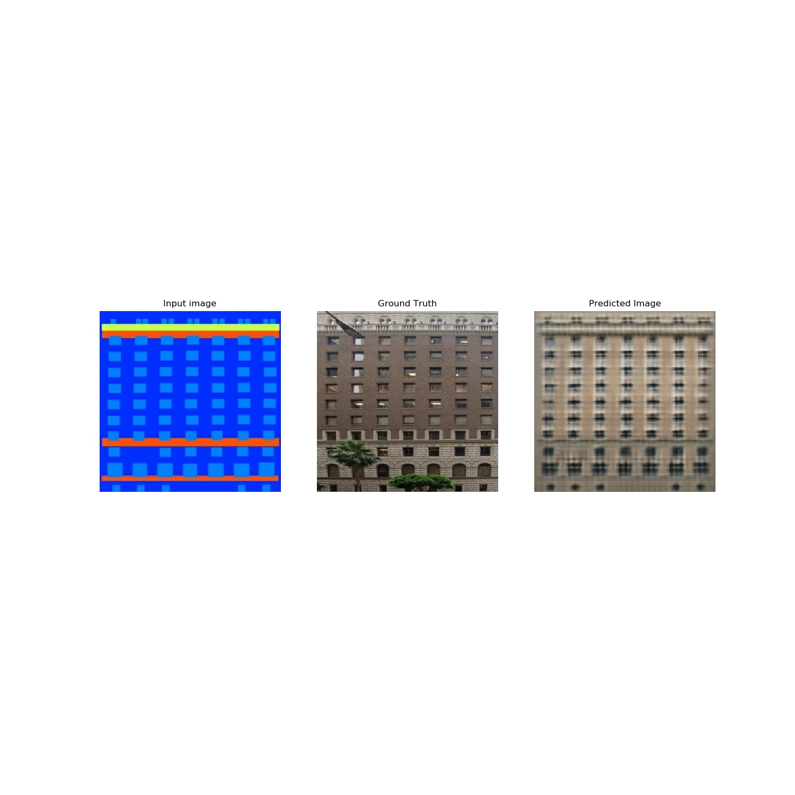
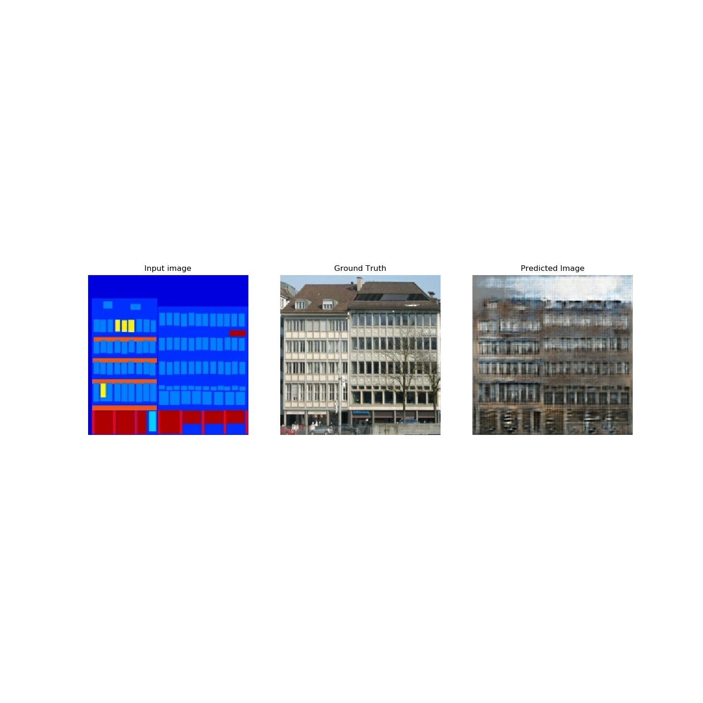
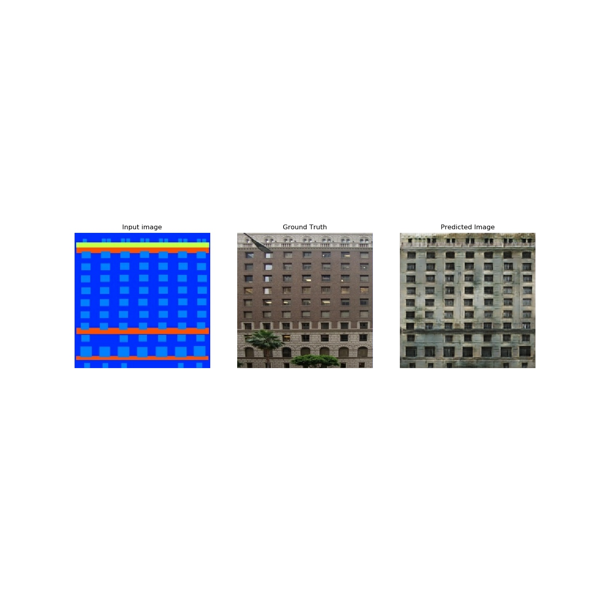
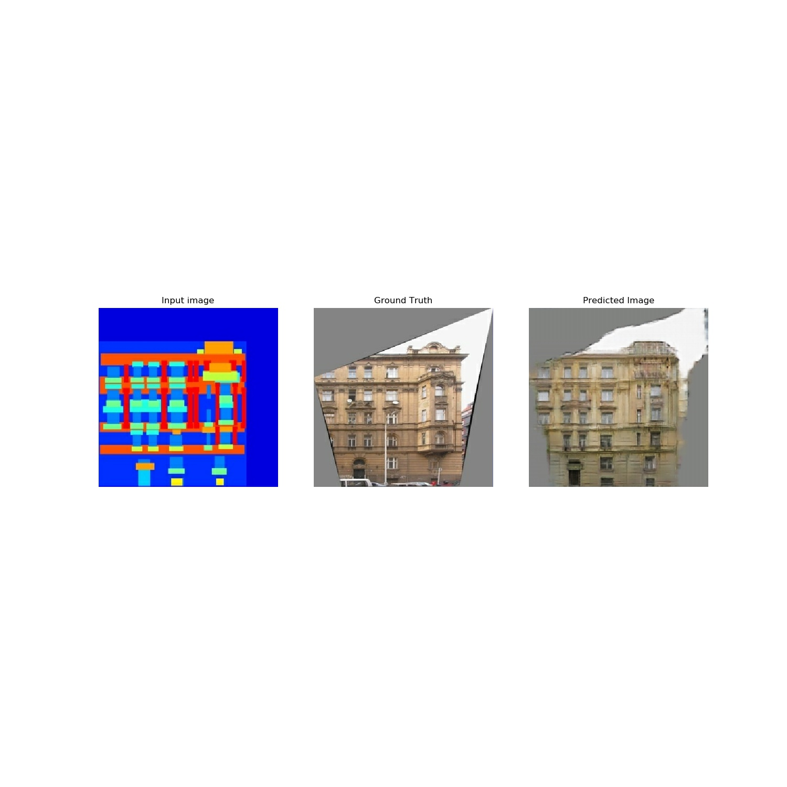
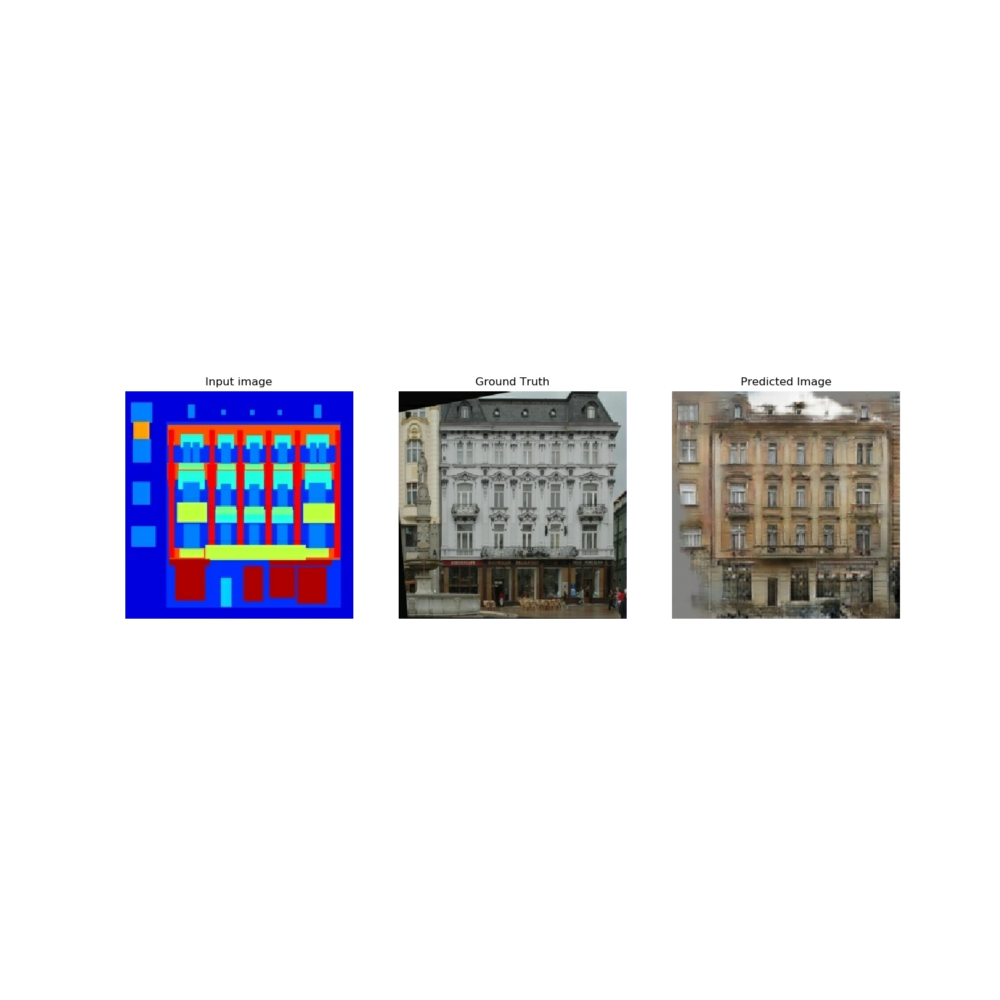

# Pix2Pix
## Reference
- Implementation of "Image-to-image translation with conditional adversarial networks"    
- https://arxiv.org/abs/1611.07004   
- https://github.com/tensorflow/docs/blob/master/site/en/r2/tutorials/generative/pix2pix.ipynb  
- The code is written with tensorflow eager execution (2.0)
## Train
- Download "facades.tar.gz" dataset and unzip it. https://people.eecs.berkeley.edu/~tinghuiz/projects/pix2pix/datasets/
- Modify the `BASE_PATH` variable in `pix2pix.py` to the data.
- run `python pix2pix.py` to train the model, the weights will
stored in `weights/`, and generated image will saved in `generated_img/`
## Test
run `python test.py` to load weights from `weights/` and generate 5 images.
## Network Architecture
- The Generator is a *U-NET* and defined in `PixGenerator.py`. The output is `tanh` activated.
- The Discriminator is a *PatchGAN* network with size 30*30.
## Data
- The dataset use `random_jitter` and `Nomalized` to [-1,1]
- The process in written in `data_preprocess.py`
## Hyper-parameter
- The `DropOut` is used in training and testing, according to the paper. There is no random vector `z` as input like
original GAN. The random of input is represented by dropout.
- In training, `BATCH_SIZE = 1` obtains better results. However, if the generator is a naive 'encoder-decocer' network, 
you should use `base_size > 1`. The `U-NET` used here can prevent the activations of bottle-neck layer to become 0. 
- In the original paper, the author called 'instance batch normalization'.
## Generated image
- Epoch 5

- Epoch 30

- Epoch 70

- Epoch 120

- Epoch 150

